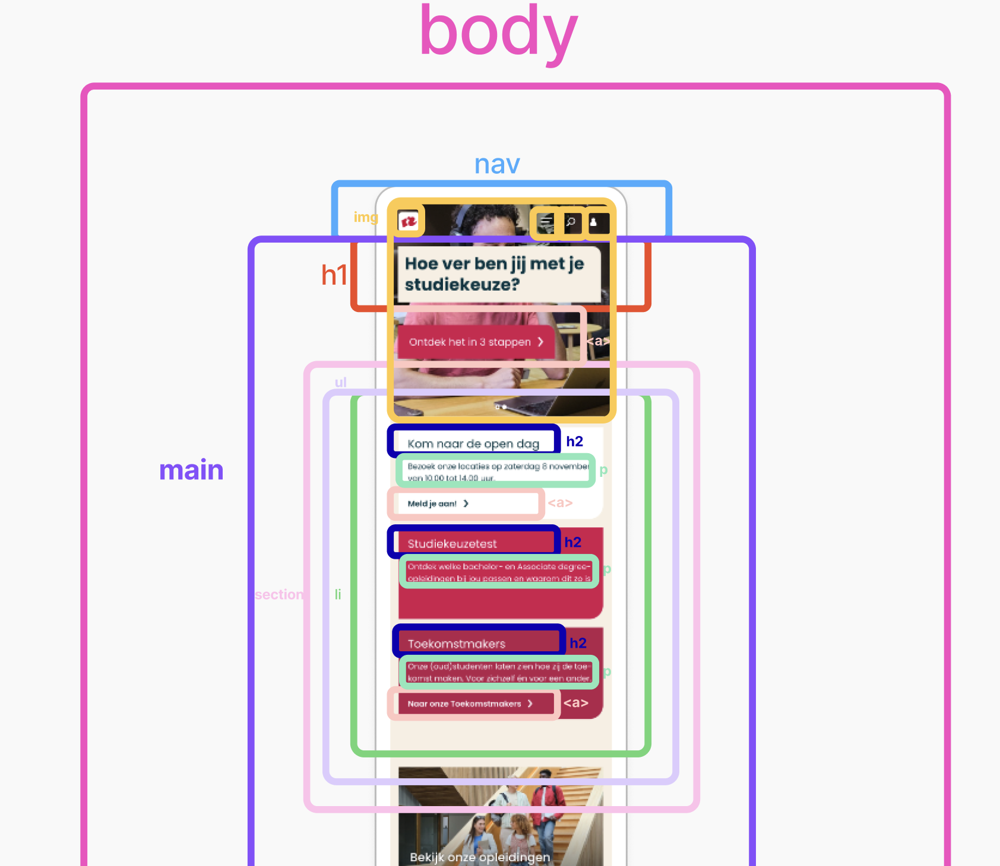

# Procesverslag
Markdown is een simpele manier om HTML te schrijven.  
Markdown cheat cheet: [Hulp bij het schrijven van Markdown](https://github.com/adam-p/markdown-here/wiki/Markdown-Cheatsheet).

Nb. De standaardstructuur en de spartaanse opmaak van de README.md zijn helemaal prima. Het gaat om de inhoud van je procesverslag. Besteedt de tijd voor pracht en praal aan je website.

Nb. Door *open* toe te voegen aan een *details* element kun je deze standaard open zetten. Fijn om dat steeds voor de relevante stuk(ken) te doen.

## Jij

  
uitwerken voor kick-off werkgroep

  ### Auteur:
  Samya El Ghazi

  #### Je startniveau:
  Blauw

  #### Je focus:
  Ik wil mij focussen op de surface plane.
 

## Je website

  
uitwerken voor kick-off werkgroep

  ### Je opdracht:
  https://www.hogeschoolrotterdam.nl/

  #### Screenshot(s) van de eerste pagina (small screen): 
  Homepagina 
  

  #### Screenshot(s) van de tweede pagina (small screen):
  Informatie over de open dag pagina
  
 

## Toegankelijkheidstest 1/2 (week 1)

  
uitwerken na test in 2e werkgroep

  ### Bevindingen
  Lijst met je bevindingen die in de test naar voren kwamen:

  ### Screenreader
  Om de website die ik ga coderen te testen of hij voldoet aan toegankelijkheid heb ik de website getest met een screenreader. Tijdens het testen heb ik een aantal interessante bevindingen gevonden.

  Tijdens het testen werden vrijwel alle links opgenoemd, maar er staan in de lijst allemaal nummers (?). Het is niet duidelijk waar deze nummers vandaan komen en wat ze betekenen. Dit is niet gebruikersvriendelijk/toegankelijk. Hierdoor haakte ik af.

  De navigatie wordt opgelezen, maar het is niet duidelijk waar we zijn in de navigatie.

  De navigatie sluit niet vanzelf. Er worden allemaal dingen opgelezen die op de pagina achter de navigatie staan.

  De Voiceover begint steeds opnieuw als je ergens op drukt, of hij leest niet verder
  
  Kopjes worden niet weergegeven die in de grid staan. Het lijkt alsof het helemaal wordt overgeslagen. De footer wordt opgelezen ipv de informatie die direct op de pagina staat.

  De voiceover vond ik best irritant, omdat het enige wat ik hoorde was "link, link, link, link". Er was geen afwisseling in het lezen van wat er op de webpagina staat.

## Breakdownschets (week 1)

  
uitwerken na afloop 3e werkgroep

  ### de hele pagina: 
  

  ### dynamisch deel (bijv menu): 
  

  ### wellicht nog een dynamisch deel (bijv filter): 
  

## Voortgang 1 (week 2)

  
uitwerken voor 1e voortgang

  ### Stand van zaken
  - Het gaat wel goed denk ik tot nu toe met de html, het enige waar ik tegen aan loop is dat veel van dezelfde elementen terug komen in de html. Ik vraag mij dan af hoe ik dit dan moet vormgeven in de css. Ik vind het ook lastig om te bepalen wat er allemaal in mijn header moet staan. Mijn website heeft wel een h1(vormgegeven als knop), maar dan met een img erachter en de nav staat op de image.

  ### Agenda voor meeting
  samen met je groepje opstellen

Phon:
1. Mag je ook (meerdere) section(s) in je footer hebben?
2. Wat is het html element die ik moet gebruiken voor de beoordeling onderaan
3. Moet er in de head een header of is dat onnodig

Zineb:
1. Hoe kun je iconen dowloaden van de site?
2. Wanneer gebruik ik section en wanneer article?
3. Wanneer gebruik ik figure en figcaption en wanneer alleen een img?

Samya:
1. Kan ik in een section andere html elementen stoppen zonder een article om de section heen te zetten?
2. Moet je een section zetten om de header als er een img in zit en een link?
3. Moeten er in de nav links staan, of buttons voor mijn menu?

Bener:
1. Wanneer gebruik ik ul en wanneer ol?
2. ik heb lang niet gecodeerd. Hoe onderscheid ik een parent van een child? En wat betekenen ze?
3. Er staat geen h1 op de homepagina van mijn website, maar met een grote logo. Mag deze als h1 worden gebruikt?

  ### Verslag van meeting
  hier na afloop snel de uitkomsten van de meeting vastleggen

  Aanwezigen:
  - Zineb
  - Kanokphon
  - Bener
  - Samya

  Docent & studentassistent:
  - Sanne
  - Anouar

  We hebben tijdens de meeting onze code besproken en elkaar feedback gegeven en antwoord kunnen geven op elkaars vragen. We hebben samen elkaars html verbeterd door er aandachtig naar te kijken en feedback te geven over welke code wel correct is en wanneer je welke code gebruikt. Ik heb bijvoorbeeld feedback gekregen op wat er in mijn header moet staan.

  Ik ben er ook achter gekomen dat ik moet kijken naar of de images decoratie of informatie zijn. Alle decoratieve images moeten daarom in de css met de css tag background-image. Ik heb nu ook weer geleerd hoe ik een h1 kan verbergen van de pagina, maar dat het toch wel door de screenreader gelezen kan worden. Ik heb ook geleerd hoe je een table of content kunt maken in je html pagina.

  Ik ben gaan realiseren dat ik wel veel nog moet gaan doen aan mijn html en dit ook moet laten valideren door student-assistenten, medestudenten en docenten & ik kan een online validator gebruiken. 

## Voortgang 2 (week 3)

  
uitwerken voor 2e voortgang

  ### Stand van zaken
  hier dit ging goed & dit was lastig (neem ook screenshots op van delen van je website en code)
  Ik vond het best lastig om font face te gebruiken in mijn css. Om 1 of andere reden deed dit het niet. Ik heb hierop feedback ontvangen van de student-assistenten. We hebben dit het hele moment uit zitten vogelen en uiteindelijk hebben we de juiste code erin kunnen zetten.

  ### Agenda voor meeting
  samen met je groepje opstellen

  | Bener      | Kanokphon         | Samya    | student 4        |
  | ---            | ---                | ---          | ---              |
  | dit bespreken  | en dit             | en ik dit    | en dan ik dat    |
  | en dat ook nog | dit als er tijd is | nog een punt | dit wil ik zeker |
  | ...            | ...                | ...          | ...              |

  ### Verslag van meeting
  hier na afloop snel de uitkomsten van de meeting vastleggen

  - punt 1
  - punt 2
  - nog een punt
- ...

## Toegankelijkheidstest 2/2 (week 4)

  
uitwerken na test in 9e werkgroep

  ### Bevindingen
  Lijst met je bevindingen die in de test naar voren kwamen (geef ook aan wat er verbeterd is):

## Voortgang 3 (week 4)

  
uitwerken voor 3e voortgang

  ### Stand van zaken
  hier dit ging goed & dit was lastig (neem ook screenshots op van delen van je website en code)

  ### Agenda voor meeting
  samen met je groepje opstellen

  Bener:
  1.⁠ ⁠Hoe maak je ook alweer een foto carousel/slider? (Automatisch)
  2.⁠ ⁠Hoe maak ik hover animaties in die carousel?
  3.⁠ ⁠Hoe maak ik die blauwe lijntjes tussendoor mijn sections in mijn website?  (lab111.nl)
  4.⁠ ⁠Specials img of banner?
  5.⁠ ⁠Hoe verstop ik de rest van tekst in mijn captions?
  6.⁠ ⁠Icoontjes in footer. Hover, linkjes, svg?
  
  Zineb:
  - Waarom zie ik niet alle html elementen van mijn footer?
  - Klopt mijn css hyrargie: common, index en testrit
  - Hoe kan ik de kleur van mijn iconen aanpassen 
  - Ik heb in mijn navigatie a gebruikt ipv buttons. Kan ik dit in javascript makkelijk gebruiken, omdat het dus niet echt wordt gelinkt naar een pagina maar op de pagina blijft.
  
  Kanokphon:
  1.⁠ ⁠Hoe kan ik in 1x dark mode via root coderen?
  2.⁠ ⁠Wat heb ik gedaan dat mijn kleuren van mijn root niet toe gepassen kunnen worden?
  3.⁠ ⁠Moet ik elke button in mijn site werkend maken?
  4.⁠ ⁠Hoe krijg ik 1 versie van de beoordeling afbeelding in css ipv deze afbeelding meerdere keren achter elkaar?
  5.⁠ ⁠Hoe moet ik de favorieten hartje bij de producten aan spreken in css.?
  6.⁠ ⁠Hoe kan ik alleen de social media bij de beoordeling naast elkaar krijgen?
  7.⁠ ⁠Hoeveel js moeten we hebben, 1 toch?

  Samya:
  1.⁠ ⁠Hoe zet ik iconen in de footer naast elkaar?
  2.⁠ ⁠⁠Mijn sluit knop van de hamburger menu doet het niet, waar kan dat aan liggen?
  3.⁠ ⁠⁠hoe style ik foto’s in een bepaalde vorm?

  ### Verslag van meeting
  hier na afloop snel de uitkomsten van de meeting vastleggen

  - punt 1
  - punt 2
  - nog een punt
  - ...

## Eindgesprek (week 5)

  
uitwerken voor eindgesprek

  ### Je uitkomst - karakteristiek screenshots:
  

  ### Dit ging goed/Heb ik geleerd: 
  Korte omschrijving met plaatjes

  

  ### Dit was lastig/Is niet gelukt:
  Korte omschrijving met plaatjes

  

## Bronnenlijst

  
continu bijhouden terwijl je werkt

  Nb. Wees specifiek ('css-tricks' als bron is bijv. niet specifiek genoeg). 
  Nb. ChatGpT en andere AI horen er ook bij.
  Nb. Vermeld de bronnen ook in je code.

  1. bron 1
  2. bron 2
  3. ...

